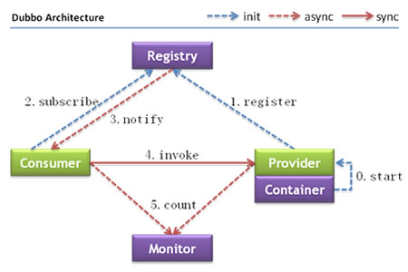

## 架构

##### 节点角色说明

| 节点 | 角色描述 |
| ------------- | ------------- |
| Provider | 提供者暴露远程服务 |
| Consumer | 消费者引用远程服务 |
| Registry | registry 提供服务注册与发现的功能 |
| Monitor  | monitor 计算服务的调用次数和响应时间|
| Container| Container管理服务的生命周期| 

##### 节点之间的关系

- Container 负责启动，加载，运行 Provider
- Provider在他启动的时候注册他的服务到Registry
- Consumer 在他启动的时候订阅Registry。
- Registry 返回服务地址列表给 Consumer,如果有变动，Registry也会通过长连接推数据给Consumer
- Consumer 通过软负载均衡算法选择其中一个 Provider进行调用，如果失败了，将会选择另外一个
- Consumer 和 Provider都会计算调用次数和响应时间 并且发送数据给 monitor

dubbo有如下特点：连通性，健壮性，可扩展，可升级
### 连通性

- Registry 负责注册和搜索服务地址，譬如目录服务。Provider 和 Consumer 只有在启动的时候
才和Registry进行交互，并且Registry不转发请求，所以压力很小
- Monitor 负责计算服务的调用次数和响应时间，统计数据会在Provider 和 Consumer的内存中组装好以后
才发送给Monitor
- Provider 注册服务到 Registry,并且上报时间消耗给Monitor(不包括网络时间消耗)
- Consumer 从Registry获取服务提供者地址列表，根据负载均衡算法选择一个直接调用，上报时间消耗
给Monitor(包括网络时间消耗)
- Consumer,Provider,Registry之间的链接是长连接，monitor是一个例外。
- Registry 通过长连接知道Provider的存在，当Provider挂了以后，Provider将会推送事件给Consumer?(这里应该是推送给Registry,Registry转而通知Consumer)
- 如果Registry 和 Monitor都down掉了，也不会影响Provider 和 Consumer等实例的运行。
因为Consumer在本地保存了一个Provider列表的副本
- Registry 和 Monitor是可选的，Consumer 能够直连 Provider

### 健壮性

- Monitor 宕机的时候不会影响使用，只是会丢失一些抽样数据
- 当数据库服务器宕机的时候（这里是什么意思，Registry用数据库实现的时候？），Registry 会通过缓存 返回给 Consumer Provider地址列表，
但是新的 Provider 不能注册
- Registry是一个对等集群，如果一个实例宕机他会自动切换到另一个实例
- 即使所有的Registry宕机了，Provider 和 Consumer会通过本地缓存继续进行交互。
- 服务 Provider是无状态的，一个Provider挂了不会影响另一个的使用
- 所有的服务都挂了，Consumer不能再使用这个服务。并且无限重连等待Provider恢复

### 可扩展
- Registry是一个对等集群，能够动态的增加实例。所有的客户端能够动态的发现新的实例
- Provider是无状态的，他能动态的增加部署实例，Registry将会推送增加的Provider实例信息给Consumer

### 可升级
当服务集群进一步扩大，信息管理结构进一步升级，动态的部署就势在必行。当前的分布式服务架构
不会带来阻力。这是一个将来可能的架构。

##### 节点角色说明
|节点| 角色说明|
|------|-------|
|Deployer| 自动服务部署的本地代理|
|Repository|存储应用包的仓库|
|Scheduler|调度器根据访问压力自动增加或者减少服务提供者|
|Admin|统一管理控制台|
|Registry|服务的注册和发现|
|Monitor|统计服务的调用和耗费时间|

