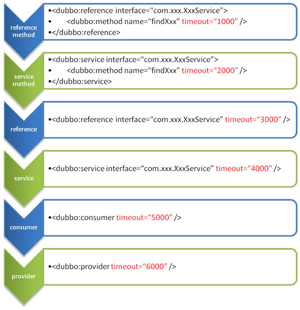

## XML 配置
关于XML的配置项，请看:[XML文档]()，如果你想直接用API而不是用spring，请参考[API配置](./5.3API配置.md),
想要一个例子去学习怎么配置，请看[快速开始](../../doc/2、快速开始/2.1快速开始.md)

### provider.xml demo
```xml
<?xml version="1.0" encoding="UTF-8"?>
<beans xmlns="http://www.springframework.org/schema/beans"
       xmlns:xsi="http://www.w3.org/2001/XMLSchema-instance"
       xmlns:dubbo="http://code.alibabatech.com/schema/dubbo"
       xsi:schemaLocation="http://www.springframework.org/schema/beans
               http://www.springframework.org/schema/beans/spring-beans-3.0.xsd
               http://code.alibabatech.com/schema/dubbo http://code.alibabatech.com/schema/dubbo/dubbo.xsd ">
    <!-- 提供者应用名称，用来跟踪依赖关系 -->
    <dubbo:application name="dubbo-demo"/>
    <!-- 提供者名称，用来追踪依赖关系 ，设置一些提供者的通用属性-->
    <dubbo:provider id="demo-provider" accesslog="true" timeout="6000" application="dubbo-demo"/>
    <!-- 组播地址段: 224.0.0.0 - 239.255.255.255  如果一个机器上同时启了多个消费者进程，消费者需声明 unicast=false，否则只会有一个消费者能收到消息：-->
    <dubbo:registry address="multicast://224.1.1.1"/>
    <!-- 使用dubbo协议在端口20880导出服务-->
    <dubbo:protocol name="dubbo" port="20880"/>
    <!-- 一个普通的spring bean-->
    <bean id="demoServiceImpl" class="com.lzl.dubbodemo.DemoServiceImpl"/>
    <!-- 声明一个导出的服务 -->
    <dubbo:service interface="com.lzl.dubbodemo.DemoService" provider="demo-provider" ref="demoServiceImpl"/>

</beans>
```

所有的标签支持自定义参数，这样我们就能在不同的扩展点上配置符合要求的配置。譬如：
```xml
<dubbo:protocl name="jms">
    <dubbo:parameter key="queue" value="your_queue"/>
</dubbo:protocl>
```
或者：
```xml
<beans xmlns="http://www.springframework.org/schema/beans"
    xmlns:xsi="http://www.w3.org/2001/XMLSchema-instance"
    xmlns:dubbo="http://dubbo.apache.org/schema/dubbo"
    xmlns:p="http://www.springframework.org/schema/p"
    xsi:schemaLocation="http://www.springframework.org/schema/beans http://www.springframework.org/schema/beans/spring-beans-4.3.xsd http://dubbo.apache.org/schema/dubbo http://dubbo.apache.org/schema/dubbo/dubbo.xsd">  
    <dubbo:protocol name="jms" p:queue="your_queue" />  
</beans>
```
### dubbo标签之间的关系


|标签|目标|介绍|
|------|---------|---------|

|```<dubbo:service/>```|服务导出|用于导出服务，定义服务元数据，可用多种协议导出服务，注册服务到多个注册中心|
|```<dubbo:reference/>```|服务引用|用于创建远程服务代理，订阅多个注册中心|
|```<dubbo:protocol/>```|协议配置|配置服务提供方的协议，服务消费者方将会沿用|
|```<dubbo:application/>```|应用配置|提供者和消费者都可以使用并配置|
|```<dubbo:module/>```|模块配置|可选|
|```<dubbo:registry/>```|注册中心|注册中心信息：地址，协议等|
|```<dubbo:monitor/>```|监控中心|监控中心信息：地址，协议等，可选|
|```<dubbo:provider/>```|提供者默认配置|service默认配置，可选|
|```<dubbo:consumer/>```|消费者默认配置|reference默认配置，可选|
|```<dubbo:method/>```|方法级别配置|reference配置和service配置都可以配置方法级别的配置|
|```<dubbo:argument/>```|参数配置|用于指定方法参数配置|

### 覆盖优先级
用timeout配置来举例，以下是优先级，从高到低(retries,loadbanlance,active 等同样适用)
- 方法级别，接口级别，全局默认级别
- 同样的级别的情况下，消费者优先级比提供者优先级更高

服务端的配置是通过注册URL到注册中心来传递到消费端的


推荐提供者为每个服务都设置timeout,因为提供者能精确知道每个服务需要执行的时间。如果消费者引用了多个服务，
他不需要知道每个服务的超时时间。

理论上讲，所有的 ReferenceConfig支持的配置项 都可以在 ServiceConfig ConcumerConfig 以及 ProviderConfig
上配置一个默认值


