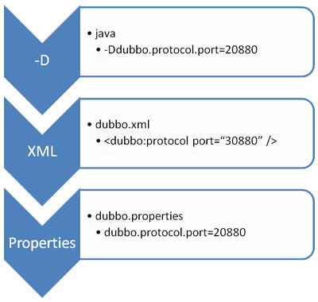

## 属性配置
如果你的应用足够简单，那么就不需要多注册中心，也不需要多协议，但是如果你想在多个spring容器间共享配置的话，你可以使用dubbo.properties
作为默认配置。

Dubbo将会加载类的根路径dubbo.properties文件。你也能通过jvm参数指定路径：-Ddubbo.properties.file=xxxx.properties

### 映射规则

属性文件中的属性结合了xml标签中的 标签名 和 属性名，用`.`分隔，一个属性一行
- `dubbo.application.name=foo` 等于 `<dubbo:application name="foo"/>`
- `dubbo.registry.address=192.168.10.1:8080` 等于 `<dubbo:registry address="192.168.10.1:8080"/>`

如果你在xml配置里边有多个tag,可以用id来区分。如果不用ID来指定，属性将会应用于所有的tag
- `dubbo.protocol.rmi.port=9999` 等于 `<dubbo:protocol id="rmi" port="9999" name="rmi"`
- `dubbo.registry.china.address=192.168.1.1:9999` 等于 `<dubbo:registry id="china" address="192.168.1.1:9999" `

以下是一个典型的dubbo.properties配置demo
```properties
dubbo.application.name=foo
dubbo.appliation.owner=bar
dubbo.registry.address=192.168.1.1:8888
``` 

### 属性覆盖和优先级



优先级从高到低：
- JVM -D 参数，你能在启动或者部署的时候轻易的更改覆盖配置，譬如覆盖dubbo的启动端口
- XML ，XML中解析出来的属性将会覆盖 dubbo.properties
- Properties ，默认属性文件，没有在jvm和xml中配置的时候才有用

