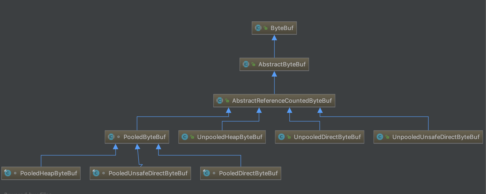
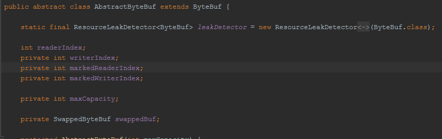
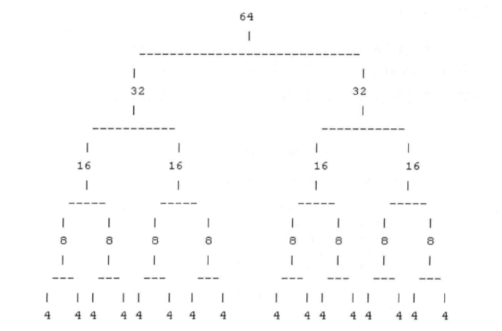
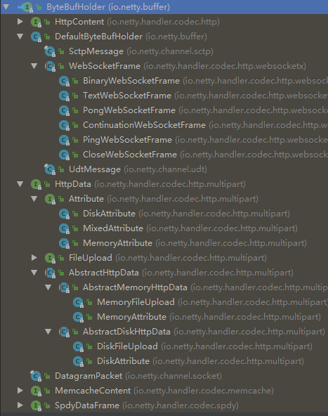

## ByteBuf功能说明
当我们进行数据传输的时候，往往需要缓冲区，常用的缓冲区就是JDK NIO类库提供的java.nio.Buffer.
实际上，7种基础类型（Boolean类除外）都有自己的缓冲区实现，对于NIO编程而言，我们主要使用的ByteBuffer. 从功能角度而言，ByteBuffer完全满足
NIO编程的需要。但是由于NIO编程的复杂性，ByteBuffer有其局限性。主要缺点如下：
 * ByteBuffer长度固定，一旦分配完成，它的容量不能动态扩展和收缩。当需要编码的POJO对象大于ByteBuffer的容量时，发发生索引越界
 * ByteBuffer只有一个标示位置的指针position,读写的时候需要手动调用flip（）和 rewind等，使用者必须小心处理这些api,否则容易导致程序失败
 * ByteBuffer的API功能有限，一些高级和实用的特性他不支持，需要使用者自己实现
为了弥补这些缺陷，Netty提供了自己的ByteBuf

### ByteBuf的工作原理
不同ByteBuf实现类的工作原理不尽相同，本小节我们从ByteBuf的设计原理出发，一起探寻netty byteBuf的设计理念。
首先，ByteBuf依然是一个Byte数组的缓冲区，他的基本功能应该与JDK的ByteBuffer一致，提供以下几类基本功能：
 * 7种java基础类，byte数组，ByteBuffer等的读写
 * 缓冲区自身的copy和slice等
 * 设置网络字节序
 * 构造缓冲实例
 * 操作位置指针等方法
 
 #### ByteBuffer
 由于JDK的Bytebuffer已经提供了这些基础能力的实现，因此，NettyByteBuffer的实现有两种策略：
 * 参考JDK的ByteBuffer的实现，增加额外的功能，解决原ByteBuffer的缺点。
 * 聚合JDKByteBuffer，通过Facade模式对其进行包装，可以减少自身的代码量，降低实现成本
 
 JDK ByteBuffer由于只有一个位置用于处理读写操作，因此每次读写的时候都需要调用额外的flip 和 clear等方法，否则功能将出错，他的典型用法如下：
 ```text
ByteBuffer buffer = ByteBuffer.allocate(88);
String value = "Netty权威指南";
buffer.put(value.getBytes());
buffer.flip();

byte[] arr = new byte[buffer.remaining());
buffer.get(arr);
String s = new String(arr);

```
我们看一下flip()操作前后的对比：
操作前：

操作后：

 flip操作是将position置为0，将limit置为position,capacity不变。如果不做flip操作，读取到的将是position 到 capacity之间的错误内容
 
 #### ByteBuf
 与之不同的是，Netty的ByteBuf通过两个位置指针来协助缓冲区的读写操作，读操作使用readerIndex，写操作使用writeIndex。readerIndex和
 writeIndex取值一开始都是0，在读取之后，0-readerIndex 就会被视为discard，调用discardReadBytes方法，可以释放这部分空间，他的作用类似
 ByteBuffer的compact方法。readerIndex和writeIndex之间的数据是可读取的，等价于ByteBuffer的position和limit之间的数据，WriteIndex和capacity
 之间是可写的，等价于ByteBuffer的position和 capacity之间的可用空间。
 
 初始化的ByteBuf如下图：

写入N哥字节以后的bytebuf如图所示

读取M（M<N)个字节以后的bytebuf如图所示

调用discardReadBytes以后的byteBuf如图所示：

调用clear之后的bytebuf如图所示


#### byteBuffer动态扩张
我们来分析一下byteBuffer是如何实现动态扩张的，通常情况下，我们对ByteBuffer进行put操作的时候，如果缓冲区可写空间不够，就会发生BufferOverFlowException。
为了避免发生这个问题，通常在put操作的时候就会对剩余的可用空间进行校验，如果剩余空间不足，需要重新创建一个新的bytebuffer，并且将之前的bytebuffer复制到新的
bytebuffer，最后释放老的bytebuffer。代码示例如下：
```text
if(this.buffer.remaining() < needSize){
    int toBeExtSize = needSize > 128 ? needSize : 128;
    ByteBuffer tmpBuffer = ByteBuffer.allocate(this.buffer.capacity()+toBeExtSize);
    this.buffer().flip();
    tmpBuffer.put(this.buffer);
    this.buffer = tmpBuffer;
}
```
从代码示例中看出，为了防止ByteBuffer溢出，每进行一次put操作，都需要对可用空间进行校验，导致了代码冗余。稍有不慎，可能引入其他问题。
netty为了解决bytebuffer动态扩张的问题，将write操作进行了封装，由bytebuffer的write操作负责进行可用空间的校验，如果缓冲区不足，bytebuf会动态扩张，
对于使用者而言，不需要关心底层的校验和扩展细节，只要不超过设置的最大缓冲区容量即可。

由于NIO的channel读写的参数都是ByteBuffer，因此，Netty的ByteBuf接口必须提供API,以方便的将ByteBuf转换成ByteBuffer，或者将ByteBuffer包装成ByteBuf。
考虑到性能，应该尽量避免缓冲区的复制，内部实现的时候可以考虑聚合一个ByteBuffer的私有指针来代表ByteBuffer。

#### readerIndex 和 writeIndex
Netty的byteBuf提供了两个变量用于支持顺序读取 和 写入操作：readerIndex用于表示读取索引，writerIndex用于标示读取索引。调用byteBuf的read操作的时候，
从readerIndex处开始读取， 
 * readerIndex到writerIndex之间的为可读缓冲区。
 * 从writerIndex到capacity之间为可写缓冲区。
 * 从0到readerIndex为discardable缓冲区，调用discardReadBytes操作来释放这部分空间，可以解决内存，防止byteBuf动态扩张
 
#### discardableBytes
相比于其他java对象，缓冲区的分配和释放是一个耗时的操作，因此，我们需要尽量重用他们，由于缓冲区的动态扩展需要进行字节数的复制，是一个耗时的操作，因此，为了
最大限度的提升程序性能，往往需要尽最大的努力提升缓冲区的重用率。
需要指出的是，调用discardableBytes会发生字节数组的内存复制，频繁调用可能会导致性能下降，因此调用之前你需要确认需要这么做，例如牺牲性能来换更多的可用内存。

#### readableBytes 和 writetablebytes 
可读空间是数据实际存储的区域，以read或者skip开头的任何操作都将会从readerindex开始读取或者跳过制定的字节数，并且readerindex相应的增加
可读空间是尚未被使用的可以填充的空闲空间，任何以write开头的操作都会从writeindex开始向空闲空间写入字节，操作完成以后writeindex相应的增加

#### clear操作
bytebuffer 和  bytebuf都一样，都是将 position，limit ，readerindex,writeindex置0，其他位置填充0x00

#### mark 和 reset
mark 保存当前索引位置，reset将之前保存的索引位置恢复出来

#### 查找操作
- indexOf(int fromIndex,int toIndex,byte value)：从当前bytebuf中定位处首次出现在value的位置，起始索引为fromindex,终点是toIndex
- bytesBefore(byte value):从当前bytebuf中定位出首次出现value的位置，起始索引为readerIndex，终点索引是writerIndex
- bytesBefore(int length,byte value):从当前ByteBuf中定位出首次出现的value的位置，起始位置为readerIndex，终点是readerIndex+length,
如果length大于可读字节数则会抛出异常
- bytesBefore(int index,int length,byte value):从当前bytebuf中定位出首先出现value的位置，起始位置为idnex,终点是index+length
- forEachByte(ByteBufProcessor processor):遍历当前ByteBuf的可读字节数，于ByteBufProcessor设置的查找条件对比，满足条件返回索引，否则返回-1
- forEachByte(int index,int length,ByteBufProcessor processor):对当前bytebuf的可读字节数，起始索引为index，终点为index+length进行遍历
- forEachByteDesc(ByteBuf processor):逆序，起始索引从writerIndex开始，查到readerIndex
- forEachByteDesc(int index,int length,ByteBufProcessor processor):逆序，起始索引从index+length-开始，直到index

#### 生成ByteBuf
类似于数据库的视图（共享数据源），byteBuf提供了多个接口用于创建某个ByteBuf的视图或者复制ByteBuf，具体方法如下：
- duplicate: 返回当前ByteBuf的复制对象，复制后返回的ByteBuf与操作的ByteBuf共享缓冲内容，但是维护自己独立的读写索引，当修改复制后的ByteBuf内容后，
之前的ByteBuf内容也随之改变，双方持有的是同一个内容的指针引用。
- copy:复制一个新的ByteBuf对象，他的内容和索引都是独立的，复制操作本身并不修改源ByteBuf的读写索引
- copy(int index,int length):从制定的索引开始复制，复制的字节长度为length;复制后的bytebuf完全独立。
- slice:返回当前的byteBuf的可读子缓冲区，起始位置从readerIndex到writeIndex,返回后的byteBuf与原byteBuf共享内容，但是读写索引独立维护，该操作并不修改原
bytebuf的readerindex和writeindex
- slice(int index,int length):返回当钱bytebuf的可读子缓冲区，起始位置为index到index+length，内容共享但索引独立

#### 转换成标注的ByteBuffer
ByteBuf-》ByteBuffer方法：
- ByteBuffer nioBuffer():返回可读的缓冲区，共享同一个缓冲区内容。无法感知原来的ByteBuf的扩容操作
- ByteBuffer nioBuffer(int index,int length):从index开始长度为length的ByteBuffer。共享缓冲区，索引独立，无法感知原ByteBuf扩容操作

#### 随机读写
无论是随机读get还是随机写set,byteBuf都会对索引和长度等进行合法性校验，set不能支持动态扩展缓冲区，使用者必须保证当前可写字节数大于写入字节数长度

### ByteBuf源码分析
我们先来看ByteBuf类的继承关系


1. 从内存分配的角度看，byteBuf可以分为两类：
- 对内存（HeapByteBuf)字节缓冲区：特点是内存的分配和回收速度快，可以被JVM自动回收：缺点是如果进行Socket的I/O读写，需要额外做一次内存复制，
将内存对应的缓冲区到内核channel中，性能会有一定的损耗
- 直接内存（DirectByteBuf）字节缓冲区：直接内存，分配和回收速度会慢一些，将它写入socket channel中时，由于少了一次内存复制，速度比对内存快。

正因为有利有弊，所以Netty提供了多种bytebuf供开发者使用，经验表明，ByteBuf的最佳实践是：
- i/o通信线程的读写缓冲区使用DirectByteBuf
- 后端业务消息的编解码模块使用HeapByteBuf. 

2. 从内存回收的角度来看，ByteBuf也分两类，基于对象池的ByteBuf和普通ByteBuf,两者的主要区别是基于对象池的的ByteBuf可以重用ByteBuf对象。他维护了一个对象池，
可以循环利用创建的ByteBuf.提升内存的使用率。降低由于高负载导致的频繁GC,测试表明使用内存池后的Netty在高负载，高并发冲击下内存和GC更加平稳。

#### AbstractByteBuf源码分析
AbstractByteBuf继承自ByteBuf,ByteBuf的公共属性和功能会在AbstractByteBuf中实现
##### 主要成员变量
首先，像读索引，写索引，mark,最大容量等公共属性的定义都在AbstractByteBuf中，如图：

我们重点关注一下leakDector,它被定义为static,意味着所有ByteBuf实例共享同一个ResourceLeakDector对象，ResourceLeakDector用于检测对象是否泄漏

##### 读操作簇
无论子类如何实现ByteBuf,UnpooledHeapByteBuf用字节数组表示字节缓冲区，UnpooledDirectByteBuf直接使用ByteBuffer,功能相同，操作结果等价。
因此，读操作以及一些其他公共操作都由父类实现，差异化功能由子类实现，这也是抽象和继承的价值所在。
譬如 ByteBuf.readBytes(byte[] dst,int dstIndex,int length),源码如下：
```text
    public ByteBuf readBytes(byte[] dst, int dstIndex, int length) {
        checkReadableBytes(length);
        getBytes(readerIndex, dst, dstIndex, length);
        readerIndex += length;
        return this;
    }
```
首先，我们对缓冲区的可用空间进行校验，校验空间代码如下：
```text
   protected final void checkReadableBytes(int minimumReadableBytes) {
        ensureAccessible();
        if (minimumReadableBytes < 0) {
            throw new IllegalArgumentException("minimumReadableBytes: " + minimumReadableBytes + " (expected: >= 0)");
        }
        if (readerIndex > writerIndex - minimumReadableBytes) {
            throw new IndexOutOfBoundsException(String.format(
                    "readerIndex(%d) + length(%d) exceeds writerIndex(%d): %s",
                    readerIndex, minimumReadableBytes, writerIndex, this));
        }
    }
```
如果读取的长度小于0，则抛出IllegalArgumentException异常。如果可读取的字节数小于length,则抛出IndexOutOfBoundsException异常
然后，从readerIndex开始读取，复制length个字节到目标数组dst中，复制后的位置从dstIndex开始。这由于和子类实现相关，所以该方法是抽象方法。
```text
public abstract ByteBuf getBytes(int index, byte[] dst, int dstIndex, int length);
```
最后读取成功的话，就对readerIndex进行递增

##### 写操作簇
与读操作类似，写操作簇的公共操作在父类中实现，我们选择与读取配套的writeBytes(byte[] src,int srcIndex,int length),他的功能是从数组中的srcIndex开始
读取length个字节写入当前byteBuf.`读操作里边的参数都是目标对象，写操作的参数都是源对象`
```text
    public ByteBuf writeBytes(byte[] src, int srcIndex, int length) {
        ensureWritable(length);
        setBytes(writerIndex, src, srcIndex, length);
        writerIndex += length;
        return this;
    }
```
首先，对可写入的长度进行校验
```text
 public ByteBuf ensureWritable(int minWritableBytes) {
        //第一步校验参数length是否合法
        if (minWritableBytes < 0) {
            throw new IllegalArgumentException(String.format(
                    "minWritableBytes: %d (expected: >= 0)", minWritableBytes));
        }
        // 第二步 length如果小于可写字节数，那么就可以写
        if (minWritableBytes <= writableBytes()) {
            return this;
        }
        //第三步，如果length大于最大可写字节数那么抛IndexOutOfBoundsException异常
        if (minWritableBytes > maxCapacity - writerIndex) {
            throw new IndexOutOfBoundsException(String.format(
                    "writerIndex(%d) + minWritableBytes(%d) exceeds maxCapacity(%d): %s",
                    writerIndex, minWritableBytes, maxCapacity, this));
        }

        // 第四步 计算需要扩容后的容量
        int newCapacity = calculateNewCapacity(writerIndex + minWritableBytes);

        //  第五步，调整至扩容后的容量
        capacity(newCapacity);
        return this;
    }
```

我们看看第四步的源码：
```text
 private int calculateNewCapacity(int minNewCapacity) {
        // 记录当前最大容量
        final int maxCapacity = this.maxCapacity;
        // 扩充容量的一个阈值，低于这个阈值，可以采用倍增的方式，高于这个阈值，每次只增加这个阈值容量，等于阈值，直接用这个阈值
        final int threshold = 1048576 * 4; // 4 MiB page 这个阈值是经验值，不同的场景可能不一样，ByteBuf取值4MB
        // 扩充容量恰好等于阈值
        if (minNewCapacity == threshold) {
            return threshold;
        }

        // 超过阈值了，每次只增加阈值大小也就是4MB的容量，这就是为了防止超过阈值后再用倍增法可能会造成的内存浪费
        if (minNewCapacity > threshold) {
            int newCapacity = minNewCapacity / threshold * threshold;
            if (newCapacity > maxCapacity - threshold) {
                newCapacity = maxCapacity;
            } else {
                newCapacity += threshold;
            }
            return newCapacity;
        }

        // 没有超过阈值，采用被增法扩充，起始值为64. 
        int newCapacity = 64;
        while (newCapacity < minNewCapacity) {
            newCapacity <<= 1;
        }
        // 获取那个不超过最大容量的扩容值
        return Math.min(newCapacity, maxCapacity);
    }
```
第五步中调整容量大小，不同实现不一样，交给子类实现
```text
public abstract ByteBuf capacity(int newCapacity);
```

##### 操作索引
与索引相关的主要是设置读写索引，mark，reset等，这些操作都非常简单，只需要判断一些合法性就行。

##### 重用缓冲区
下面我们对discardReadBytes进行源码分析：
```text
  public ByteBuf discardReadBytes() {
        // 检查确认buf没有被release
        ensureAccessible();
        // 如果可读索引为0，那么就没有可释放的字节
        if (readerIndex == 0) {
            return this;
        }
        // 如果读索引 不等于 写索引，说明缓冲区既有可抛弃的已读字节，还有尚未读取的字节
        // 调用setBytes进行字节复制，将尚未读取的字节复制到缓冲区的起始位置，然后重新设置读写索引，写索引为复制的字节长度 writeIndex-readerIndex
        // 读索引为0 
        if (readerIndex != writerIndex) {
            setBytes(0, this, readerIndex, writerIndex - readerIndex);
            writerIndex -= readerIndex;
            adjustMarkers(readerIndex);
            readerIndex = 0;
        } else {
            // 读索引等于写索引，直接调整markedreadwriteIndex-readerIndex.
            adjustMarkers(readerIndex);
            writerIndex = readerIndex = 0;
        }
        return this;
    }
```
其中的adjustMarkers方法，是在设置读写索引的同时，需要调整markedReaderIndex和markedWriteIndex,源码如下：
```text
protected final void adjustMarkers(int decrement) {
        //  保存之前的markedReaderIndex
        int markedReaderIndex = this.markedReaderIndex;
        // 如果之前的markedReaderIndex 小于 当前要减少的数，那么markedReaderIndex直接置0，否则markedReaderIndex -= decrement.
        // 本质意思就是 将之前的 markedReadIndex 和 markedWriteIndex直接 减少 decrement,如果结果小于0就直接置0
        if (markedReaderIndex <= decrement) {
            this.markedReaderIndex = 0;
            int markedWriterIndex = this.markedWriterIndex;
            if (markedWriterIndex <= decrement) {
                this.markedWriterIndex = 0;
            } else {
                this.markedWriterIndex = markedWriterIndex - decrement;
            }
        } else {
            this.markedReaderIndex = markedReaderIndex - decrement;
            markedWriterIndex -= decrement;
        }
    }
```

##### skipbytes 跳过字节数
在解码的时候，需要忽略非法的数据，或者跳过不需要读取的字节数，就使用skipBytes,只检验合法性并更改读索引。

#### AbstractReferenceCountedByteBuf源码分析
该类主要是对引用进行计数，类似JVM内存回收的引用计数器，用于跟踪对象的分配和销毁，做自动内存回收。
下面通过看源码来看其实现
##### 成员变量
```text
 // 通过原子的方式对成员变量进行更新等操作
 private static final AtomicIntegerFieldUpdater<AbstractReferenceCountedByteBuf> refCntUpdater =
            AtomicIntegerFieldUpdater.newUpdater(AbstractReferenceCountedByteBuf.class, "refCnt");
    // 标识refCnt字段在AbstractReferenceCountedByteBuf中的内存地址（和JDK实现强相关）
    private static final long REFCNT_FIELD_OFFSET;

    static {
        long refCntFieldOffset = -1;
        try {
            if (PlatformDependent.hasUnsafe()) {
                refCntFieldOffset = PlatformDependent.objectFieldOffset(
                        AbstractReferenceCountedByteBuf.class.getDeclaredField("refCnt"));
            }
        } catch (Throwable t) {
            // Ignored
        }

        REFCNT_FIELD_OFFSET = refCntFieldOffset;
    }
    // 跟踪对象的引用次数，用volatile是为了解决多线程的可见性问题
    @SuppressWarnings("FieldMayBeFinal")
    private volatile int refCnt = 1;
```

##### 对象引用计数器
每调用一次retain方法，计数器就会加1，由于可能存在多线程并发调用的情况 ，所以他的累加操作必须是安全的，我们看实现细节：
```text
   public ByteBuf retain() {
        // 自旋，操作失败再次操作
        for (;;) {
            int refCnt = this.refCnt;
            if (refCnt == 0) {
                throw new IllegalReferenceCountException(0, 1);
            }
            if (refCnt == Integer.MAX_VALUE) {
                throw new IllegalReferenceCountException(Integer.MAX_VALUE, 1);
            }
            // 通过CAS修改计数器
            if (refCntUpdater.compareAndSet(this, refCnt, refCnt + 1)) {
                break;
            }
        }
        return this;
    }
```
与retain实现类似，但是是进行计数减1的操作的 方法 是release，需要注意的是，refCnt == 1时意味着 申请和释放相等，此时对象已经不可达，该对象需要被释放并且回收，通过
deallocate方法类释放byteBuf对象
```text
  public final boolean release() {
        for (;;) {
            int refCnt = this.refCnt;
            if (refCnt == 0) {
                throw new IllegalReferenceCountException(0, -1);
            }
            
            if (refCntUpdater.compareAndSet(this, refCnt, refCnt - 1)) {
                // 对象不可达，需要释放内存
                if (refCnt == 1) {
                    // 交给子类去实现
                    deallocate();
                    return true;
                }
                return false;
            }
        }
    }
```

#### UnpooledHeapByteBuf源码分析
UnpooledHeapByteBuf是基于堆内存进行分配的缓冲区，他没有基于对象池实现，意味着每次IO都会创建一个新的UnpooledHeapByteBuf,频繁进行大块内存的分配和回收会对性能造成一定的影响，
但相比于对外内存的申请和释放，它的成本更低。相比于PooledByteBuf,UnpooledByteBuf实现原理更简单，也不容易出现管理方面的问题，因此在满足性能的情况下，推荐使用UnpooledHeapByteBuf.
##### 成员变量
```text
    // 聚合了一个ByteBufAllocator 用于UnpooledHeapByteBuf的内存分配
    private final ByteBufAllocator alloc;
    // byte字节缓冲区
    private byte[] array;
    // 用于ByteBuf到ByteBuffer的转换
    private ByteBuffer tmpNioBuf;
```

#### PooledByteBuf内存池原理分析
ByteBuf内存池的实现涉及到的类和数据结构非常多，所以只从设计原理进行分析
##### PoolArena
Arena 就是区域的意思。PoolArena就是netty内存池的实现类.
为了集中管理内存的分配和释放，同时提高分配和释放的性能，很多框架都会事先申请一大块内存，通过提供相应的分配和释放接口来使用内存，这样一来，对内存的分配和释放就会集中到几个类
或者函数中，由于不再频繁的申请和释放内存，应用的性能会得到提高，这种思路下，申请的一大块内存被称为Memory Arena.
Netty的PoolArena是由多个Chunk组成的一大块内存区域，每个Chunk由一个或者多个Page组成，因此对内存的组织和管理就变成了怎么组织和管理Chunk和page了。PoolArena定义如下：
```text
    final PooledByteBufAllocator parent;

    private final int pageSize;
    private final int maxOrder;
    private final int pageShifts;
    private final int chunkSize;
    private final int subpageOverflowMask;

    private final PoolSubpage<T>[] tinySubpagePools;
    private final PoolSubpage<T>[] smallSubpagePools;

    private final PoolChunkList<T> q050;
    private final PoolChunkList<T> q025;
    private final PoolChunkList<T> q000;
    private final PoolChunkList<T> qInit;
    private final PoolChunkList<T> q075;
    private final PoolChunkList<T> q100;
```

##### PoolChunk
chunk主要用于管理组织的内存的分配和释放，在Netty中，chunk中的page被构建成一个二叉树，假设一个chunk由16个page组成，那么chunk的组成方式如下图：

page的大小是4个字节，chunk大小是64个字节，chunk有5层，底层是用来分配所有page的内存，第四层用来分配2个page的内存
每个节点都记录了自己在Memory Arena中的偏移地址。当一个节点代表的内存区域被分配出去以后，这个节点会被标记为已分配。这个节点下层的所有节点在后边的内存分配中都会被忽略。
对树的遍历采用深度优先方法，选择哪个子节点遍历是随机的。

##### PoolSubPage
对于一个小于Page的内存，Netty在Page中完成分配。每个Page会被切分成大小相等的多个存储块，存储块的大小由第一个申请的内存块大小决定。
假如一个Page是8个字节，第一次申请的是4字节，那么这个Page会被分成2块。
**一个page只能用于分配和第一次申请内存大小相等的内存块**。假如，一个page第一次被分配了1个字节，那么page就会分成4块。如果有一个请求来申请2个字节，这个page是不能进行分配的。
需要在一个新的page中进行分配
page中存储区域的使用状态用一个long数组来维护。数组中的每个long的每一位用来表示一个块存储区域的占用情况：0表示未占用，1表示已经占用。
举个例子：一个128字节的page,需要128个位。128位需要2个long类型的数据（1个long8字节，64位，2个long16字节，128位）
类定义如下：
```text
final class PoolSubpage<T> {
    final PoolChunk<T> chunk;
    final int memoryMapIdx;
    final int runOffset;
    final int pageSize;
    final long[] bitmap;

    PoolSubpage<T> prev;
    PoolSubpage<T> next;

    boolean doNotDestroy;
    int elemSize;
    int maxNumElems;
    int nextAvail;
    int bitmapLength;
    int numAvail;
```

### ByteBuf相关辅助功能介绍
#### ByteBufHolder
ByteBufHolder是ByteBuf容器，在Netty中，它非常有用，例如Http请求消息和应答消息都可以携带消息体，这个消息体在NIO buffer中 就是ByteBuffer,在Netty中就是ByteBuf对象
由于不同协议的消息体可以包含不同的协议字段和功能，因此需要对ByteBuf进行包装和抽象，不同的子类可以有不同的实现。
为了满足这些定制化的需求，Netty抽象出了ByteBufHolder,他包含了一个ByteBuf,还提供了一些其他实用的方法，使用者继承ByteBufHolder以后可以按需扩展封装自己的实现。
ByteBufHolder继承架构如下：



 
 