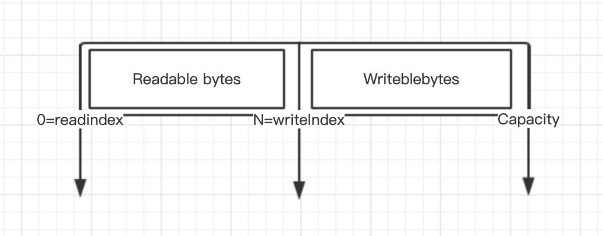

## ByteBuf功能说明
当我们进行数据传输的时候，往往需要缓冲区，常用的缓冲区就是JDK NIO类库提供的java.nio.Buffer.
实际上，7种基础类型（Boolean类除外）都有自己的缓冲区实现，对于NIO编程而言，我们主要使用的ByteBuffer. 从功能角度而言，ByteBuffer完全满足
NIO编程的需要。但是由于NIO编程的复杂性，ByteBuffer有其局限性。主要缺点如下：
 * ByteBuffer长度固定，一旦分配完成，它的容量不能动态扩展和收缩。当需要编码的POJO对象大于ByteBuffer的容量时，发发生索引越界
 * ByteBuffer只有一个标示位置的指针position,读写的时候需要手动调用flip（）和 rewind等，使用者必须小心处理这些api,否则容易导致程序失败
 * ByteBuffer的API功能有限，一些高级和实用的特性他不支持，需要使用者自己实现
为了弥补这些缺陷，Netty提供了自己的ByteBuf

### ByteBuf的工作原理
不同ByteBuf实现类的工作原理不尽相同，本小节我们从ByteBuf的设计原理出发，一起探寻netty byteBuf的设计理念。
首先，ByteBuf依然是一个Byte数组的缓冲区，他的基本功能应该与JDK的ByteBuffer一致，提供以下几类基本功能：
 * 7种java基础类，byte数组，ByteBuffer等的读写
 * 缓冲区自身的copy和slice等
 * 设置网络字节序
 * 构造缓冲实例
 * 操作位置指针等方法
 
 #### ByteBuffer
 由于JDK的Bytebuffer已经提供了这些基础能力的实现，因此，NettyByteBuffer的实现有两种策略：
 * 参考JDK的ByteBuffer的实现，增加额外的功能，解决原ByteBuffer的缺点。
 * 聚合JDKByteBuffer，通过Facade模式对其进行包装，可以减少自身的代码量，降低实现成本
 
 JDK ByteBuffer由于只有一个位置用于处理读写操作，因此每次读写的时候都需要调用额外的flip 和 clear等方法，否则功能将出错，他的典型用法如下：
 ```text
ByteBuffer buffer = ByteBuffer.allocate(88);
String value = "Netty权威指南";
buffer.put(value.getBytes());
buffer.flip();

byte[] arr = new byte[buffer.remaining());
buffer.get(arr);
String s = new String(arr);

```
我们看一下flip()操作前后的对比：
操作前：

操作后：

 flip操作是将position置为0，将limit置为position,capacity不变。如果不做flip操作，读取到的将是position 到 capacity之间的错误内容
 
 #### ByteBuf
 与之不同的是，Netty的ByteBuf通过两个位置指针来协助缓冲区的读写操作，读操作使用readerIndex，写操作使用writeIndex。readerIndex和
 writeIndex取值一开始都是0，在读取之后，0-readerIndex 就会被视为discard，调用discardReadBytes方法，可以释放这部分空间，他的作用类似
 ByteBuffer的compact方法。readerIndex和writeIndex之间的数据是可读取的，等价于ByteBuffer的position和limit之间的数据，WriteIndex和capacity
 之间是可写的，等价于ByteBuffer的position和 capacity之间的可用空间。
 
 初始化的ByteBuf如下图：

写入N哥字节以后的bytebuf如图所示

读取M（M<N)个字节以后的bytebuf如图所示

调用discardReadBytes以后的byteBuf如图所示：

调用clear之后的bytebuf如图所示


#### byteBuffer动态扩张
我们来分析一下byteBuffer是如何实现动态扩张的，通常情况下，我们对ByteBuffer进行put操作的时候，如果缓冲区可写空间不够，就会发生BufferOverFlowException。
为了避免发生这个问题，通常在put操作的时候就会对剩余的可用空间进行校验，如果剩余空间不足，需要重新创建一个新的bytebuffer，并且将之前的bytebuffer复制到新的
bytebuffer，最后释放老的bytebuffer。代码示例如下：
```text
if(this.buffer.remaining() < needSize){
    int toBeExtSize = needSize > 128 ? needSize : 128;
    ByteBuffer tmpBuffer = ByteBuffer.allocate(this.buffer.capacity()+toBeExtSize);
    this.buffer().flip();
    tmpBuffer.put(this.buffer);
    this.buffer = tmpBuffer;
}
```
从代码示例中看出，为了防止ByteBuffer溢出，每进行一次put操作，都需要对可用空间进行校验，导致了代码冗余。稍有不慎，可能引入其他问题。
netty为了解决bytebuffer动态扩张的问题，将write操作进行了封装，由bytebuffer的write操作负责进行可用空间的校验，如果缓冲区不足，bytebuf会动态扩张，
对于使用者而言，不需要关心底层的校验和扩展细节，只要不超过设置的最大缓冲区容量即可。

由于NIO的channel读写的参数都是ByteBuffer，因此，Netty的ByteBuf接口必须提供API,以方便的将ByteBuf转换成ByteBuffer，或者将ByteBuffer包装成ByteBuf。
考虑到性能，应该尽量避免缓冲区的复制，内部实现的时候可以考虑聚合一个ByteBuffer的私有指针来代表ByteBuffer。

 
 