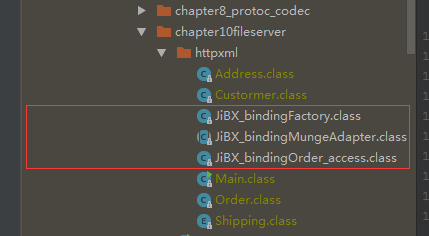

## jibx
- 创建src/lib目录
- 拷贝该项目中的jar包到lib目录下
- 执行com.lzl.netty.chatper10fileserver.httpxml.Main.main()方法（其实就是为了编译一下类到target中）
- windows下cd到target/classes目录下 执行以下命令1
```text
java -cp .;F:/ideaworkspace/springaop/src/lib/jibx-tools-1.3.1.jar;F:/ideaworkspace/springaop/src/lib/jibx-run-1.3.1.jar;F:/ideaworkspace/springaop/src/lib/jibx-bind-1.3.1.jar;F:/ideawork
space/springaop/src/lib/jibx-schema-1.3.1.jar;F:/ideaworkspace/springaop/src/lib/jibx-extras-1.3.1.jar;F:/ideaworkspace/springaop/src/lib/bcel-6.2.jar;F:/ideaworkspace/springaop/src/lib/log4j-1.2.17.jar;F:/ideaworkspace/springaop
/src/lib/qdox-1.12.1.jar;F:/ideaworkspace/springaop/src/lib/xpp3-1.1.3.4.O.jar  org.jibx.binding.generator.BindGen -v com.lzl.netty.chapter10fileserver.httpxml.Order
```
- 在当前目录下生成binding.xml 和 httpxml.xsd

- 继续执行以下命令2
```text
java -cp .;F:/ideaworkspace/springaop/src/lib/jibx-tools-1.3.1.jar;F:/ideaworkspace/springaop/src/lib/jibx-run-1.3.1.jar;F:/ideaworkspace/springaop/src/lib/jibx-bind-1.3.1.jar;F:/ideawork
space/springaop/src/lib/jibx-schema-1.3.1.jar;F:/ideaworkspace/springaop/src/lib/jibx-extras-1.3.1.jar;F:/ideaworkspace/springaop/src/lib/bcel-6.2.jar;F:/ideaworkspace/springaop/src/lib/log4j-1.2.17.jar;F:/ideaworkspace/springaop
/src/lib/qdox-1.12.1.jar;F:/ideaworkspace/springaop/src/lib/xpp3-1.1.3.4.O.jar  org.jibx.binding.Compile binding.xml
```
- 在classes/com/lzl/netty/chapter10fileserver/httpxml生成3个class文件如图


- 至此，jibx准备工作已经完成

- 然后执行TestOrder.main方法。
发现报错
```text
Exception in thread "main" Unable to access binding information for class com.lzl.netty.chapter10fileserver.httpxml.Order
Make sure the binding has been compiled
java.lang.NoSuchFieldException: JiBX_bindingList
	at java.lang.Class.getDeclaredField(Class.java:2070)
	at org.jibx.runtime.BindingDirectory.getBindingList(BindingDirectory.java:68)
	at org.jibx.runtime.BindingDirectory.getFactory(BindingDirectory.java:211)
	at com.lzl.netty.chapter10fileserver.httpxml.TestOrder.encode2xml(TestOrder.java:23)
	at com.lzl.netty.chapter10fileserver.httpxml.TestOrder.main(TestOrder.java:46)
```
- 百思不得其解的情况下，折腾了很久，添加了maven依赖和jibx-maven-plugin等各种玩意
然后发现 先添加 maven-jibx-plugin
```xml
   <dependency>
            <groupId>org.jibx</groupId>
            <artifactId>maven-jibx-plugin</artifactId>
            <version>1.3.1</version>
   </dependency>
```
然后重新执行命令2，然后就可以运行了
结果如下：
```text
<?xml version="1.0" encoding="UTF-8"?>
<order xmlns="http://lzl.com/netty/chapter10fileserver/httpxml" orderNumber="123" total="9999.999">
  <custormer custormerNumber="123">
    <firstName>李</firstName>
    <lastName>zanle</lastName>
  </custormer>
  <billTo>
    <street1>曾国藩大道</street1>
    <city>娄底</city>
    <state>湖南省</state>
    <postCode>123321</postCode>
    <country>中国</country>
  </billTo>
  <shipping>INTERNATIONAL_MAIL</shipping>
  <shipTo>
    <street1>曾国藩大道</street1>
    <city>娄底</city>
    <state>湖南省</state>
    <postCode>123321</postCode>
    <country>中国</country>
  </shipTo>
</order>
<?xml version="1.0" encoding="UTF-8"?>
<order xmlns="http://lzl.com/netty/chapter10fileserver/httpxml" orderNumber="123" total="9999.999">
  <custormer custormerNumber="123">
    <firstName>李</firstName>
    <lastName>zanle</lastName>
  </custormer>
  <billTo>
    <street1>曾国藩大道</street1>
    <city>娄底</city>
    <state>湖南省</state>
    <postCode>123321</postCode>
    <country>中国</country>
  </billTo>
  <shipping>INTERNATIONAL_MAIL</shipping>
  <shipTo>
    <street1>曾国藩大道</street1>
    <city>娄底</city>
    <state>湖南省</state>
    <postCode>123321</postCode>
    <country>中国</country>
  </shipTo>
</order>
``` 