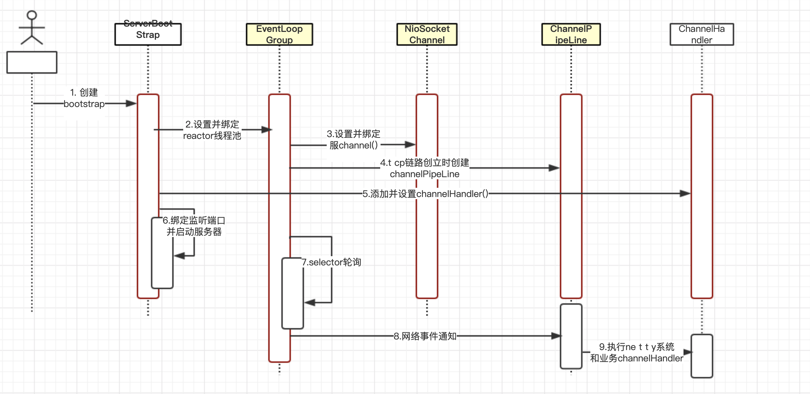
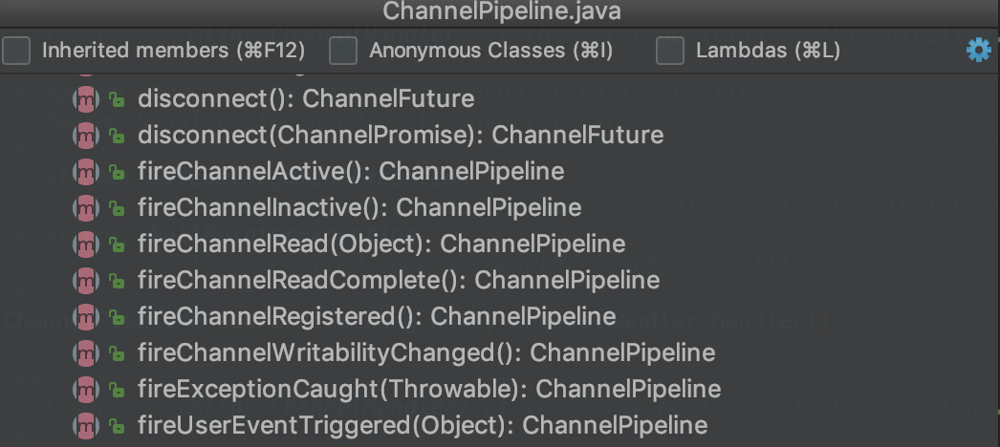

## Netty 服务端创建时序图


下面我们对netty服务端创建的关键步骤和原理进行讲解

- 创建ServerBootStrap实例，ServetBootStrap是Netty服务端的启动辅助类，它提供了一系列的方法用于设置服务端启动的相关参数。底层通过门面模式对各种能力
进行抽象和封装。尽量不需要用户跟过多的底层api打交道，降低用户的开发难度。
serverbootstrap是采用builder模式的类，没有构造函数是因为参数太多了，并且参数未来可能变化。

- 设置并绑定reactor线程池。Netty的reactor线程池是EventLoopGroup.实际上是EventLoop的数组。EventLoop的指责是处理所有注册到本线程多路复用器selector
上的channel. selector的轮询操作由绑定的EventLoop线程run方法驱动。在一个循环内部执行。
值得说明的是，EventLoop的职责不仅仅是处理网络i/o事件，用户自定义的Task 和定时人物 也可以由EventLoop负责处理。这样线程模型就实现了统一。
从调度层面看，也不存在从EventLoop线程中再启动其他类型的线程用于异步执行另外的任务。避免了多线程并发和锁的竞争，提升了i/o线程的处理和调度性能。

- 设置并绑定服务端channel. 作为Nio服务器，需要创建ServerSocketChannel,Netty对原声的NIO类库进行的封装，对应的实现是NioServerSocketChannel.
对于用户而言，不需要关心服务器端Channel的底层实现细节和工作原理，只需要制定具体使用那种服务端channel即可。因此，netty的ServerBootStrap方法提供
了channel方法用于制定服务器的channel类型，Netty通过工厂类，利用反射创建NioServerSocketChannel对象。由于服务端监听端口往往只需要在系统启动的时候
才会调用，因此反射对性能的影响不大。

- 链路建立的时候创建并初始化channelPipeLine，ChannelPipeLine并不是Nio服务端必须的，它的本质是一个处理网络事件的职责链，负责管理和执行channelHandler.
网络事件以事件流的形式在channelPipeLine中流转。由channelPipeLine根据channelHandler的调度策略调度channelHandler执行。典型的网络事件有：
 * 链路注册
 * 链路激活
 * 链路断开
 * 接收到请求消息
 * 消息接收并处理完毕
 * 发送应答消息
 * 链路发生异常
 * 发生用户自定义事件
 
- 初始化ChannelPipeLine以后，添加并设置channelHandler.ChannelHandler是netty提供给用户定制和扩展的关键接口。利用channelHandler，用户可以完成大多数
的功能定制。例如消息解码，心跳，安全认证，tsl/ssl认证，流量控制和流量整形等。netty同时也提供了大量的channelHandler供用户使用。比较实用的系统channelHandler
总结如下：
 * 系统编解码框架--ByteToMessageCodec;
 * 通用基于长度的半包解码器--LengthFieldBasedFrameDecoder
 * 码流日志打印Handler--LoggingHandler
 * ssl安全认证handler--SslHandler
 * 链路空闲检测Handler--IdleStateHandler
 * 流量整形Handler--ChannelTrafficShapingHandler
 * Base64编解码--Base64Decoder Base64Encoder
 
 - 绑定并启动监听端口，在绑定监听端口之前系统会做一系列的初始化和检测工作，完成之后，会启动监听端口，将ServerSocketChannel注册到selector上监听客户端连接
 
 - selector轮询，由reactor线程NioEventLoop负责调度和执行selector轮询操作，选择准备就绪的channel集合，相关代码如下：
 ```text
private void select() throws Exception{
    Selector selector = this.selector;
    try{
        // 此处代码省略...
        int selectedKeys = selector.select(timeoutMillis);
        selectCnt ++;
        // 此处代码省略...
    }
}
```

- 当轮询到准备就绪的channel以后，由reactor线程 NioEventLoop 执行ChannelPipeLine的相应方法，最终调度并执行channelHandler 。channelPipeline方法如图：


- 执行netty系统channelHandler和用户添加定制的channelHandler. channelPipeLine根据网络事件的类型，调度并执行channelHandler。相关代码如下：
```text
public ChannelHandlerContext fireChannelRead(Object msg) {
    DefaultChannelHanlderContext next = findContextInBound(MASK_CHANNEL_READ);
    next.invoker.invokeChannel(next,msg);
    return this;
}
```