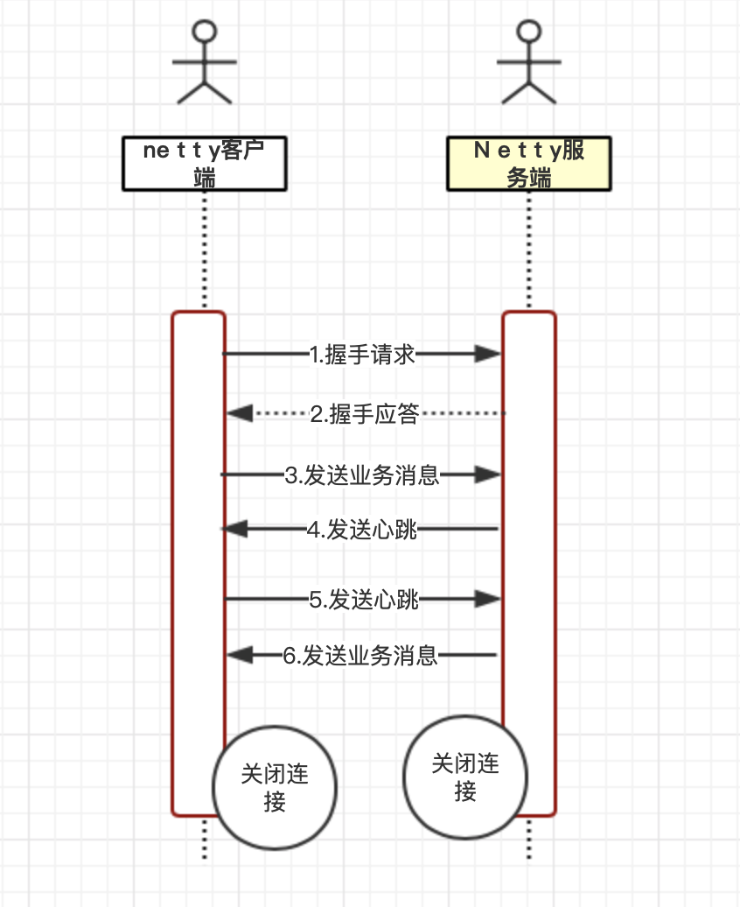

## 协议栈功能描述
netty协议栈承载了业务内部各模块之间的消息交互和服务调用，它的主要功能呢如下：
- 基于netty的NIO通信框架，提供高性能的异步通信能力
- 提供消息的编解码框架，可以实现pojo的序列化和反序列化
- 提供基于ip地址的白名单接入认证机制
- 链路的有效性校验机制。
- 链路的断连重连机制。

## 通信模型
netty协议通信栈模型图如下图所示：


具体步骤如下：
1. netty协议栈客户端发送握手请求消息，携带节点Id等有效身份认证信息
2. netty协议栈服务端对握手请求消息进行合法性校验，包括节点id有效性
校验，节点重复登陆校验和ip地址合法性校验。校验通过后，返回登陆成功的
握手应答消息。
3. 链路建立成功以后，客户端发送业务消息。
4. 链路成功以后，服务端发送心跳消息。
5. 链路建立成功后，客户端发送心跳消息。
6. 链路建立成功后，服务端发送业务消息。
7. 服务端退出后，服务端关闭连接。客户端感知对方关闭连接后，被动关闭客户端连接。

## 消息定义
netty协议栈消息定义包含两个部分：
- 消息头
- 消息体
具体定义如表所示
### netty消息定义表
| 名称|类型|长度|描述|
| ------- | --------- | --------- | -----------|
| header | Header | 变长 | 消息头定义 |
| body | Object | 变长 | 对于请求消息，它是方法的参数（作为示例，只支持携带一个参数），对于响应消息，它是返回值 |

### netty协议消息头定义
| 名称|类型|长度|描述|
| ------- | --------- | --------- | -----------|
| crcCode | 整形int | 长度32 | netty消息的校验吗，由三部分组成：1）0xABEF:魔数，表明该消息是netty协议消息。2个字节；2) 主版本号：1-255，一个字节；3）次版本号：1-255，1个字节。crcCode=0XABEF+主版本号+次版本号|
| length | 整形int | 32 | 消息长度，整个消息，包括消息头和消息体 |
| sessionID | 长整型long | 64 | 集群节点内全局唯一，由会话Id生成器生成 |
| type | Byte | 8 | 0:业务请求消息 1：业务响应消息 2：业务ONE way消息 3:握手请求消息 4：握手应答消息 5：握手心跳消息 6：心跳应答消息|
| priority | Byte | 8 | 消息优先级0-255 |
| attachment | Map<String,Object> | 变长 | 可选字段，用于扩展消息头 |

### netty协议支持的字段类型

| 字段类型 | 备注说明 |
| ------- | --------- |
| boolean | 包括包装类型Integer |
| byte | 包括包装类型Byte |
| int | 对应c/c++ 的 int32 |
| char | 包括包装类型character |
| short | 对应c/c++的 int16 |
| long | 对应c/c++的int64 |
| float | 包括包装类型Float |
| double | 包括包装类型Double |
| string | 对应c/c++的string |
| list | 支持各种list实现 |
| array | 支持各种数组的实现|
| map | 支持Map的嵌套和泛型|
| set | 支持Set的嵌套和泛型|

### netty协议的编解码规范

##### netty协议的编码
netty协议 NettyMessage的编码规范如下。
- crcCode:java.nio.ByteBuffer.putInt(int value)，如果采用其他缓冲区实现，必须与其等价
- sessionId:java.nio.ByteBuffer.putLong(long value),如果采用其他缓冲区实现，必须与其等价
- length:java.nio.ByteBuffer.putInt(int value),如果采用其他缓冲区实现，必须与其等价
- type:java.nio.ByteBuffer.put(byte b),如果采用其他缓冲区实现，必须与其等价
- priority:java.nio.ByteBuffer.put(byte b),如果采用其他缓冲区实现，必须与其等价
- attachment:他的编码规则为----如果attachment的长度为0，表示没有可选附件。则将长度编码设置为0，
java.nio.ByteBuffer.putInt(0);如果大于0，说明有附件需要编码。具体编码规则如下
  * 首先对附件的个数进行编码，java.nio.ByteBuffer.putInt(attachment.size());
  * 然后对Key进行编码，先编码长度，再将他转换成byte数组之后编码内容，具体代码如下：
  ```
    String key = null;
    byte[] value = null;
    for(Map.Entry<String,Object> param : attachment.entrySet()){
        key = param.getKey();
        buffer.writeString(key);
        value = marshaller.writeObject(param.getValue);
        buffer.writeBinary(value);
    }
    key = null;
    value = null;
  ```
  > 需要说明的是，将String字符串写入ByteBuffer和通过JbossMarchalling将Object序列化为byte数组，
  此处没有详细展开介绍。
  
- body的编码，将Jboss Marchalling 将其序列化为byte数组，然后调用java.nio.ByteBuffer.put(byte[] src)
将其写入ByteBuffer缓冲区
由于整个消息的长度必须等全部自己都编码完成之后才能确认，所以最后需要更新消息头中的length字段

##### netty协议的解码
相对于NettyMessage的编码，仍旧以java.nio.ByteBuffer为例，给出Netty协议的解码规范。
- crcCode:通过java.nio.ByteBuffer.getInt()获取校验码字段，其他缓冲区需要与其等价
- length:通过java.nio.ByteBuffer.getInt()获取netty消息的长度，其他缓冲区需要与其等价
- sessionID:通过java.nio.ByteBuffer.getLong 获取会话ID,其他缓冲区需要与其等价
- type:通过java.nio.ByteBuffer.get()获取消息类型，其他缓冲区需要与其等价。
- priority:java.nio.ByteBuffer.get()获取消息优先级,其他缓冲区需要与其等价。
- attachment:他的解码规则为--首先创建一个attachmnent对象，调用java.nio.ByteBuffer.getInt()
获取附件的长度。如果为0，说明附件为空，解码结束。如果非空，则根据长度for循环进行解码。
    ```
      String key = null;
      Object value = null;
      for ( int i = 0; i < size ; i++){
         key = buffer.readString();
         value = unmarshaller.readObject(buffer.readBinary());
         this.attachment.put(key,value);
      } 
      key = null;
      value = null;
    ```
- body: 通过Jboss的marshaller对其进行解码

### 链路的建立
netty的协议栈支持服务端和客户端，对于使用netty协议栈的应用程序而言，不需要可以区分到底是客户端还是服务端，
在分布式组网环境中，一个节点可能既是客户端也是服务端，依据具体场景而定。
netty协议栈对客户端来的说明 如下：如果A节点需要调用B节点的服务，但是A和B之间没有建立物理链路，则由调用房
主动发起连接，此时，调用方为客户端，被调用房为服务端。
考虑到安全，链路建立需要通过基于ip地址或者号段的黑白名单安全认证机制，作为样例，本协议使用基于Ip地址的安全
认证，如果有多个ip，通过逗号进行分割，在实际的商用项目中，安全认证机制会更加严格。例如通过密钥对用户名和密码
进行安全认证。

客户端与服务端链路建立成功以后，由客户端发送握手请求消息，握手请求消息的定义如下：
1. 消息头的type字段值为3；
2. 可选附件的个数为0；
3. 消息体为空
4. 握手消息的长度为22个字节

服务端接收到客户端的握手请求消息以后，如果ip校验通过，握手成功应答消息返回给客户端，应用层链路建立成功。
握手应答消息定义如下。
1. 消息头的type字段值为4。
2. 可选附件个数为0
3. 消息体为byte类型的结果，0表示认证成功，-1表示认证失败。链路建立成功以后，客户端和服务端就可以互相
发送业务消息了。

### 链路的关闭
由于采用长连接通信，在正常的业务运行期，双方通过心跳和业务消息维持链路。任何一方都不需要主动关闭链路。
但是在以下情况，客户端和服务端需要关闭连接。
1. 对方宕机或者重启的时候，会主动关闭链路，另一方读取到操作系统的通知信号，得知对方reset链路，需要关闭连接。
释放自身的句柄等资源。由于tcp采用全双工通信，通信双方都需要关闭连接，释放资源。
2. 消息读写过程中，发生了i/o异常，需要主动关闭连接
3. 心跳消息读写过成中发生了i/o异常，需要主动关闭连接。
4. 心跳超时，需要主动关闭连接。
5. 发生编码异常等不可恢复的错误是，需要主动关闭连接。

### 可靠性设计
netty协议栈可能会运行在非常恶劣的网络环境中，网络超时，闪断，对方进程僵死或者处理缓慢等情况都有可能发生。
为了保证这些 极端情况netty协议能够正常工作或者自动恢复，需要对他的可靠性进行统一规划和设计。
##### 心跳机制
在凌晨等业务低谷期，发生网络闪断，连接被hang住等网络问题，由于没有业务消息，应用进程很难发现。
到了白天业务高峰期，就会发生大量的网络通信失败。严重的会导致一段时间内无法处理业务消息。为了解决这个问题，
在网络空闲采用心跳机制来检测链路的互通性，一旦发现网络故障，立即关闭链路。主动重连。

具体设计思路如下：
1. 当网络处于空闲状态持续时间达到T（连续周期T没有读写消息）时，客户端发送PIng消息给服务端。
2. 如果在下一个周期T到来时客户端没有收到对方发送的Pong心跳应答消息或者读取到服务器发送其他的业务消息，
则心跳失败计数器加1。
3. 每当客户端接收到服务的业务消息或者pong应答消息时，将心跳失败计数器清0。当连续N次没有收到服务端的pong
消息或者业务消息，则关闭链路。间隔interval时间后发起重连操作。
4. 服务端网络空闲状态持续时间达到T后，服务端将心跳失败计数加1，只要接收到客户端发送的ping消息或者其他业务
消息，计数器清0。
5. 服务端连续N次没有接收到客户端ping消息或者其他业务消息，则关闭链路。释放资源，等待客户端重连。

通过ping-pong双向心跳机制，可以保证无论通信哪一方出现网络故障，都能被及时的检测出来。为了防止由于对方短时间
内繁忙没有及时返回应答造成的误判，只有连续N次心跳检测都失败才认定链路已经损害。需要关闭并重建链路。

当读写或者心跳消息发生i/o异常的时候，说明链路已经终端，此时需要立即关闭链路，如果是客户端，需要重新发起连接。
如果是服务端，需要清空缓存的半包信息。等待客户端重连

##### 重连机制
如果链路终端，等待interval时间后，由客户端发起重连操作。如果重连失败，间隔周期interval后再次发起重连。
直到重连成功。
为了保证服务端有充足的时间释放句柄等资源，在首次断连时，客户端需要等待interval时间后再发起重连。而不是失败
后就立即重连。
为了保证句柄等资源能够及时释放，无论什么场景下的重连失败，客户端都保证自己的资源被及时释放，包括但不限于
socketChannel,socket等。
重连失败后，需要打印异常堆栈信息，方便后续定位问题。

##### 重复登陆保护
当客户端握手成功以后，在链路处于争夺状态下，不允许客户端重复登陆。以防止客户端在异常状态下反复重连导致句柄
资源被耗尽。

服务端接收到客户端的握手请求消息以后，首先对于ip地址进行合法性校验，如果校验成功，在缓存的地址表中查看客户端
是否已经登陆。如果已经登陆，拒绝重复登陆。返回错误码-1，同时关闭tcp链路，并在服务端日志中打印握手失败原因。

客户端接收到握手失败的应答消息以后，关闭客户端的tcp连接。等待interval时间后，再次发起tcp连接。直到认证成功。
为了防止由服务端和客户端对链路状态理解不一致导致的客户端无法握手成功的问题，当服务器连续n次心跳超时之后需要
主动关闭链路，清空该客户端的地址缓存信息。以保证后续该客户端可以重连成功，防止被重复登陆保护机制拒绝。

##### 消息缓存重发
无论客户端还是服务端，当发生链路终端以后，在链路恢复以前，缓存在消息队列中待发送的消息不能丢失，等链路恢复之后，
重新发送这些消息，保证链路中断期间消息不丢失。
考虑到内存溢出的风险，建议消息缓存队列设置上限，达到上限后，拒绝向队列添加新的消息。


### 安全性设计
为了保证整个集群环境的安全，内部长连接采用基于ip地址的安全认证机制，服务端对握手请求消息的ip进行合法性校验。
如果在白名单内，则校验通过。否则拒绝连接。
如果将netty协议栈放到公网中使用，需要采用更加严格的安全认证机制。例如基于密钥和AES加密的用户民加密码认证
机制，也可以采用ssl/tsl安全传输。
作为示例程序，netty协议栈采用最简单的基于ip地址的白名单安全认证机制。

### 可扩展性设计
netty协议需要具备一定的扩展能力。业务可以在消息头中自定义业务域字段，例如消息流水号，业务自定义消息头等。
通过netty消息头中的可选附件attachement字段，业务可以方便的进行自定义扩展。
netty协议栈架构需要具备一定的扩展能力，例如统一的消息拦截，接口日志，安全，加解密等可以被方便的添加和删除。
不需要修改之前的逻辑代码。类似servlet的Filter chain 和 aop。考虑到性能因素，不推荐通过aop来实现功能的扩展。


